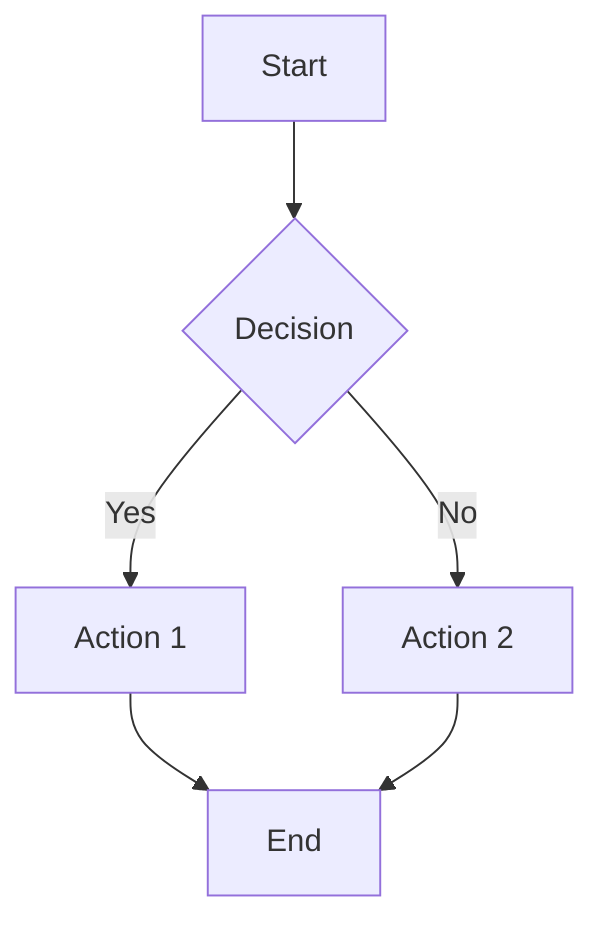

# Markdown Syntax Guide

| Symbol | Usage |
|--------|-------|
| `#`    | Heading level 1 (largest heading) |
| `##`   | Heading level 2 |
| `###`  | Heading level 3 |
| `####` | Heading level 4 |
| `#####` | Heading level 5 |
| `######` | Heading level 6 (smallest heading) |
| `**` or `__` | Bold text |
| `*` or `_` | Italic text |
| `***` or `___` | Bold and italic text |
| ``~~`` | Strikethrough Text |
| `>`    | Blockquote |
| `` ` `` | Inline code |
| `` ``` `` | Code block |
| `-` or `*` or `+` | Unordered list |
| `1.` `2.` `3.` | Ordered list |
| `[]` | Checkbox in lists |
| `[]()` | Link (example: `[title](URL)`) |
| `` | Image (example: ``) |
| `---` or `***` | Horizontal rule |
| `|` | Column separator in tables |
| `:---` | Align column to left in tables |
| `:---:` | Align column to center in tables |
| `---:` | Align column to right in tables |
| `two or more spaces` | line break |
| `<br />` | line break |

---

## 📝 **Complete Example Paragraph**

Here's a **comprehensive paragraph** demonstrating *multiple* Markdown features simultaneously.<br />
It contains `inline code`, a [link to Google](https://google.com), and even a footnote.[^3]<br />
We can use ~~strikethrough~~ and ==highlighting== when supported.<br />
Mathematical formulas like $a^2 + b^2 = c^2$ can be included.<br />
Emoji make it fun :sparkles: and <kbd>keyboard</kbd> shortcuts are useful.<br />
This shows how Markdown handles complex, mixed-content paragraphs effectively.

[^3]: This footnote shows up at the bottom of the document.

---

## 🎨 **Special Features**

### **Emoji**
:rocket: :smile: :warning: :white_check_mark: :x:

### **Keyboard Keys**
Press <kbd>Ctrl</kbd> + <kbd>C</kbd> to copy.<br />
Use <kbd>Esc</kbd> to exit.

### **Abbreviations**
The HTML specification is maintained by the W3C.

*[HTML]: Hyper Text Markup Language
*[W3C]: World Wide Web Consortium

### **Mathematical Expressions (if supported)**
Inline: $E = mc^2$

Block:
$$
\int_{a}^{b} f(x)\,dx = F(b) - F(a)
$$

### **Mermaid Diagrams (if supported)**

